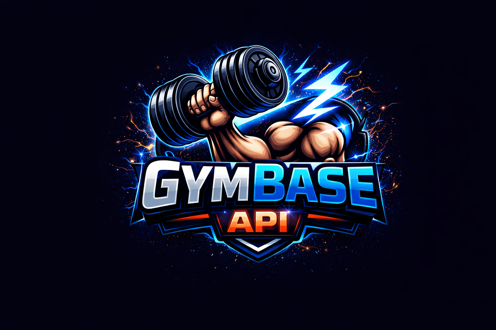

<div align="center">
   

   <h1>GymBase Platform</h1>

   

   <p>
      
      
      
      
      
      
      
      
   </p>
</div>

## Overview

GymBase is a full-stack developer platform for fitness data, designed as an API engine plus a modern web console.

It includes:

- account registration and email verification
- JWT login and API key access
- daily and monthly usage tracking
- built-in rate limiting per user
- interactive dashboard with charts and endpoint playground

The API service delivers exercise JSON and image assets, while the web console provides an animated experience for auth, API usage visibility, and request testing.

## Security and Delivery

- JWT-based session auth for protected account usage endpoints
- API key auth for programmatic access to exercise endpoints
- SMTP-based verification and password reset email workflows
- Tokenized email verification and password reset links
- Per-user usage policy enforcement via middleware

## Feature Set

### Backend

- User authentication and account lifecycle
- Email verification flow (token-based)
- Forgot/reset password flow (token + expiry)
- JWT-protected user usage endpoint
- API key and Bearer token support for exercise endpoints
- Per-user limits:
   - daily: 50 calls
   - monthly: 500 calls
- Auto-generated API key for each verified user
- Exercise data endpoints:
   - list all
   - find by id
   - find by exact name (case-insensitive)
   - filter by muscle group

### Web Console

- Login, Register, Verify Email, Forgot Password, Reset Password pages
- Dashboard with:
   - usage cards
   - 7-day history chart
   - endpoint list and playground modal
   - API key copy/reveal interactions
- Responsive UI and animated dashboard interactions
- Configurable backend base URL via Vite env
- Favicon enabled in app shell

## Tech Stack

- Backend: Node.js, Express, MongoDB, Mongoose, bcryptjs, jsonwebtoken, nodemailer
- Web Console: React, Vite, Axios, Recharts, Lucide Icons, React Router

## Project Structure

```text
GymBase_API/
|- backend/
|  |- config/
|  |- controllers/
|  |- data/
|  |- images/
|  |- middlewares/
|  |- models/
|  |- routes/
|  |- .env.example
|  |- index.js
|  \- package.json
|- frontend/
|  |- public/
|  |- src/
|  |- .env.example
|  |- index.html
|  \- package.json
\- README.md
```

## API Architecture

```mermaid
flowchart LR
      A[React Web Console] -->|JWT| B[/api/usage]
      A -->|x-api-key or Bearer| C[/api/exercises/*]
      C --> D[Rate Limiter]
      B --> E[(MongoDB)]
      C --> E
      F[/api/auth/*] --> E
      F --> G[SMTP Provider]
```

## Getting Started

### 1. Clone and install

```bash
git clone <your-repo-url>
cd GymBase_API
cd backend && npm install
cd ../frontend && npm install
```

### 2. Configure backend env

Create `backend/.env` (or copy from `backend/.env.example`):

```env
PORT=5000
NODE_ENV=development
JWT_SECRET=your_strong_jwt_secret_here

MONGO_URI=mongodb+srv://<user>:<password>@clusterx.xxxxx.mongodb.net/gymbaseapi

# URL used in verification/reset links sent by email
FRONTEND_URL=http://localhost:5173

# SMTP settings
SMTP_HOST=smtp-relay.brevo.com
SMTP_PORT=587
SMTP_USER=your_brevo_smtp_user@smtp-brevo.com
SMTP_PASS=your_brevo_smtp_password
email=your_verified_sender@example.com

# Optional (forces image URLs)
BASE_URL=http://localhost:5000
```

### 3. Configure web console env

Create `frontend/.env` (or copy from `frontend/.env.example`):

```env
VITE_API_URL=http://localhost:5000
```

### 4. Run both apps

Backend:

```bash
cd backend
npm run dev
```

Web Console:

```bash
cd frontend
npm run dev
```

Default URLs:

- Web Console: http://localhost:5173
- Backend: http://localhost:5000

## API Endpoints

### Auth

- `POST /api/auth/register`
- `POST /api/auth/login`
- `GET /api/auth/verify-email/:token`
- `POST /api/auth/forgot-password`
- `POST /api/auth/reset-password/:token`

### Exercises (Protected + Rate Limited)

Headers:

- `x-api-key: <api_key>`
- or `Authorization: Bearer <jwt>`

Endpoints:

- `GET /api/exercises`
- `GET /api/exercises/id/:id`
- `GET /api/exercises/name/:name`
- `GET /api/exercises/muscle/:muscle`

### Usage (JWT Required)

Header:

- `Authorization: Bearer <jwt>`

Endpoint:

- `GET /api/usage`

Returns:

- daily usage and limit
- monthly usage and limit
- 7-day usage history
- current API key

## Quick Flow

1. Register a user
2. Verify email from token link
3. Login and get JWT
4. Open dashboard and copy API key
5. Call exercise endpoints with `x-api-key` or JWT
6. Monitor consumption in `/api/usage`

## Build and Production Notes

- `backend/index.js` serves frontend build assets when `NODE_ENV=production`
- build frontend using:

```bash
cd backend
npm run build:frontend
```

## Troubleshooting

- `401 Missing authentication`: add `x-api-key` or Bearer token for exercise APIs
- `403 Please verify your email`: verify account first
- `429 limit exceeded`: wait for limit window reset (daily/monthly)
- No email received:
   - verify SMTP env values
   - check sender email is approved by provider
- Web console cannot call backend:
   - confirm `frontend/.env` has correct `VITE_API_URL`
   - restart Vite after env changes

## Credits

Exercise images/data source:

- https://github.com/yuhonas/free-exercise-db

## License

ISC
